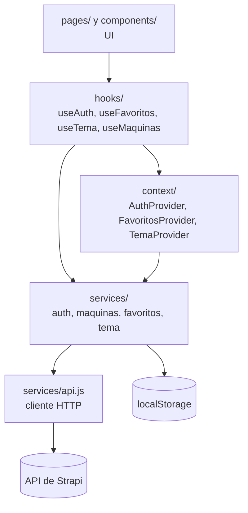

# Arquitectura

Cómo está organizado el código y cómo viajan los datos desde la API hasta la
pantalla.

## Capas

El código se separa en capas. Cada una solo usa a la de abajo:



| Capa | Responsabilidad |
|---|---|
| `pages/` | Una página por ruta. Arman la vista con componentes y hooks. |
| `components/` | Piezas reutilizables de UI. No hacen peticiones por su cuenta. |
| `hooks/` | Exponen el estado a la UI. Los de contexto fallan con un error claro si se usan fuera de su provider. |
| `context/` | Estado global compartido por toda la app (sesión, favoritos, tema). |
| `services/` | Todo el acceso a datos: la API y el `localStorage`. Devuelven datos ya mapeados al formato que usa la UI. |
| `services/api.js` | Único lugar que llama a `fetch`. Arma la URL, agrega el token, renueva la sesión y normaliza los errores. |

Así, si cambia la API o se mueven los favoritos al backend, el cambio queda
dentro de `services/` y las páginas no se enteran.

## Punto de entrada y providers

[`src/main.jsx`](../src/main.jsx) envuelve la app con los providers en este
orden:

```jsx
<TemaProvider>             // tema claro/oscuro: no depende de nada
  <BrowserRouter>
    <AuthProvider>         // sesión del usuario
      <FavoritosProvider>  // usa useAuth: tiene que ir dentro de AuthProvider
        <App />
```

El orden importa: `FavoritosProvider` lee el usuario de `useAuth` para saber
qué favoritos cargar.

## Rutas

Definidas en [`src/App.jsx`](../src/App.jsx). Todas comparten el
[`Layout`](../src/components/layout/Layout.jsx) (barra superior fija con
`Header` + `NavBar`, contenido y `Footer`):

| Ruta | Página | Descripción |
|---|---|---|
| `/` | [`Home`](../src/pages/Home.jsx) | Hero, tipos de maquinaria y últimas incorporaciones |
| `/catalogo` | [`Catalogo`](../src/pages/Catalogo.jsx) | Listado completo. Acepta `?favoritas=1` |
| `/login` | [`Login`](../src/pages/Login.jsx) | Formulario de inicio de sesión |

Los links de navegación (`Inicio`, `Catálogo`) salen de
[`navLinks.js`](../src/components/layout/navLinks.js), que comparten el header
móvil, la nav bar y el footer.

## Flujo de datos: las máquinas

1. Una página llama a `useMaquinas({ sort })`. El Home pide
   `createdAt:desc` para mostrar las más nuevas primero; el catálogo usa el
   orden por defecto (`marca:asc`).
2. El hook llama a `getMaquinas()` de
   [`services/maquinas.js`](../src/services/maquinas.js), que pide
   `GET /api/maquinas?populate=imagen&sort=...`.
3. El servicio **mapea** cada máquina de Strapi al formato de la UI:

   ```js
   {
     documentId,       // identificador para keys y favoritos
     tipo, marca, modelo,
     nombre,           // `${marca} ${modelo}`
     imagenes: [{ src, alt }],
   }
   ```

   - `id` e `interno` se descartan: son internos y ningún componente los
     necesita.
   - Para cada imagen se usa el formato `small` si existe y, si no, la
     original. Las URLs relativas (`/uploads/...`) se completan con la URL del
     backend (`urlMedia()` en `api.js`).
   - Si la imagen no tiene texto alternativo, se arma uno con tipo y nombre.
4. El hook devuelve `{ maquinas, cargando, error, reintentar }`, y la página
   se lo pasa a [`EstadoCarga`](../src/components/EstadoCarga.jsx).

### `EstadoCarga`

Envuelve cualquier grilla que dependa de la API y decide qué mostrar:

| Estado | Qué se ve |
|---|---|
| `cargando` | Esqueletos con la misma forma que las tarjetas, para que el layout no salte |
| `error` | Panel con un mensaje según el código (sin conexión, `403`, `5xx`) y botón **Reintentar** |
| `vacio` | Panel "No hay máquinas para mostrar", con un texto configurable |
| si no | El contenido (`children`) |

## Manejo de errores

`api.js` convierte todo error en un `ApiError` con `status` y `message`:

- **`status: 0`**: no hubo respuesta (backend apagado, CORS, red) o falta
  `VITE_API_URL`. El mensaje ya está listo para mostrar.
- **Otro `status`**: el código HTTP, con el `error.message` que devuelve Strapi.

Cada pantalla traduce esos errores a mensajes para el usuario:
`EstadoCarga` para las máquinas y `Login` para el inicio de sesión. Los
errores que no tienen un lugar fijo en la página (por ejemplo, no se pudo
guardar un favorito) se muestran con el aviso flotante
[`Aviso`](../src/components/Aviso.jsx).

## Componentes principales

| Componente | Qué hace |
|---|---|
| [`MaquinaCard`](../src/components/MaquinaCard.jsx) | Tarjeta de una máquina: imagen, etiqueta de tipo, nombre y botón de favorito |
| [`BotonFavorito`](../src/components/BotonFavorito.jsx) | Corazón para marcar o desmarcar. Sin sesión lleva al login |
| [`EstadoCarga`](../src/components/EstadoCarga.jsx) | Esqueletos, error, vacío o contenido (ver arriba) |
| [`MenuPerfil`](../src/components/MenuPerfil.jsx) | Botón de perfil del header con desplegable para cerrar sesión |
| [`SelectorTema`](../src/components/SelectorTema.jsx) | Menú de tema claro/oscuro, accesible con teclado |
| [`Aviso`](../src/components/Aviso.jsx) | Mensaje de error flotante abajo de la pantalla |
| [`Logo`](../src/components/Logo.jsx) / [`HeroIlustracion`](../src/components/HeroIlustracion.jsx) | Gráficos SVG inline que toman los colores del tema |

## Accesibilidad

- Los menús (`SelectorTema`, `MenuPerfil`) se cierran con clic afuera o con
  `Escape`. El selector de tema sigue el patrón *menu button* de WAI-ARIA:
  flechas para moverse, `Enter`/`Espacio` para elegir.
- Los botones de solo ícono tienen `aria-label`, y los que se activan y
  desactivan (favorito, "Mis favoritas") usan `aria-pressed`.
- Las cargas se anuncian con `aria-busy` y un texto solo para lectores de
  pantalla, y los errores con `role="alert"`.
- Los colores de texto sobre fondo cumplen un contraste de 4.5:1 en los dos
  temas (ver [estilos.md](estilos.md)).
