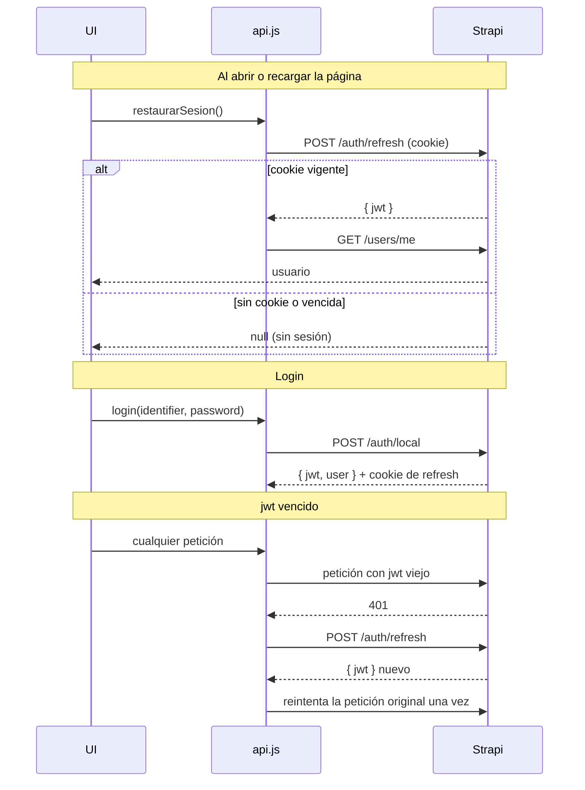

# Autenticación

El login usa el plugin **Users & Permissions** de Strapi en modo
**refresh token**. El código está en
[`services/api.js`](../src/services/api.js),
[`services/auth.js`](../src/services/auth.js) y
[`context/AuthProvider.jsx`](../src/context/AuthProvider.jsx).

## Los dos tokens

| Token | Dónde vive | Duración | Para qué |
|---|---|---|---|
| **Access token** (`jwt`) | En una variable de `api.js`, **solo en memoria** | 10 minutos | Se manda en cada petición: `Authorization: Bearer <jwt>` |
| **Refresh token** | Cookie **httpOnly** que setea el backend | Hasta 30 días | Pedir un `jwt` nuevo |

El `jwt` **no se guarda en `localStorage`**: si la página tuviera un script
malicioso (XSS), no podría robarlo de ahí. La cookie de refresh tampoco se
puede leer desde JavaScript. Por eso todas las peticiones van con
`credentials: 'include'`, para que el navegador la mande sola.

## Flujo



### Restaurar la sesión al recargar

Al recargar, el `jwt` en memoria se pierde. `AuthProvider` llama a
`restaurarSesion()` al montarse: si la cookie de refresh sigue vigente pide un
`jwt` nuevo y trae el usuario con `GET /users/me`; si no, el visitante queda
sin sesión.

Mientras tanto `cargando` es `true`, y el header deja vacío el lugar del botón
"Ingresar". Así, alguien que ya tiene sesión no ve "Ingresar" por un instante
antes de que aparezca su perfil.

### Renovación automática

Si una petición responde `401`, `api()` pide un `jwt` nuevo con
`POST /auth/refresh` y la **reintenta una sola vez**. Esto no se hace para
`/auth/local` ni para `/auth/refresh`, porque son las rutas que dan el token.

El backend **rota la cookie en cada refresh**: la anterior deja de valer. Si
dos peticiones vencen al mismo tiempo y cada una hiciera su propio refresh, la
segunda usaría una cookie ya invalidada. Por eso `refrescarToken()` guarda la
petición en curso y las llamadas simultáneas **comparten la misma promesa**.

### Logout

`logout()` llama a `POST /auth/logout`, que borra la cookie en el backend, y
borra el `jwt` de memoria **aunque la petición falle**. `AuthProvider` también
limpia el usuario pase lo que pase, así la sesión local siempre se cierra.

## El usuario en la UI

`services/auth.js` reduce el usuario de Strapi a lo que usa la UI:

```js
{ id, username, email }
```

El usuario por defecto de Strapi no tiene nombre real ni foto. Por eso el saludo
del Home usa `username` y el menú de perfil muestra un ícono genérico.

Se accede desde cualquier componente con el hook `useAuth()`:

```js
const { usuario, cargando, login, logout } = useAuth()
```

## Página de login

[`pages/Login.jsx`](../src/pages/Login.jsx):

- Acepta **email o nombre de usuario** en el mismo campo.
- Si el usuario ya tiene sesión (recién logueado, o entró a `/login` a mano),
  lo redirige.
- Puede recibir en el `state` de la navegación un **aviso** y una ruta
  **`desde`**. Lo usa el botón de favoritos: sin sesión lleva al login con el
  aviso "Para agregar una máquina a favoritos, primero debés iniciar sesión" y,
  después de ingresar, vuelve a la página de origen (con sus parámetros de
  búsqueda). Sin `desde`, vuelve al Home.
- Si el login falla, borra la contraseña y muestra un mensaje según el error:

| Respuesta | Mensaje |
|---|---|
| Sin conexión (`status 0`) | "No se pudo conectar con el servidor" |
| `400` con "blocked" | "Tu cuenta está bloqueada. Contactá a un administrador." |
| `400` | "Usuario o contraseña incorrectos." |
| `429` | "Hiciste demasiados intentos. Esperá un minuto y probá de nuevo." |
| `5xx` | "El servidor tuvo un problema. Probá de nuevo en unos minutos." |
| Otro | "No se pudo iniciar sesión. Probá de nuevo." |

## Cookies y dominios

La cookie de refresh es `SameSite=Lax`:

- **En desarrollo** funciona porque `localhost:5173` y `localhost:1337` son el
  mismo sitio (el puerto no cuenta).
- **En producción** el front y el back tienen que estar bajo el mismo dominio
  (por ejemplo `app.midominio.com` y `api.midominio.com`) y servirse por HTTPS,
  porque ahí la cookie además es `Secure`.
